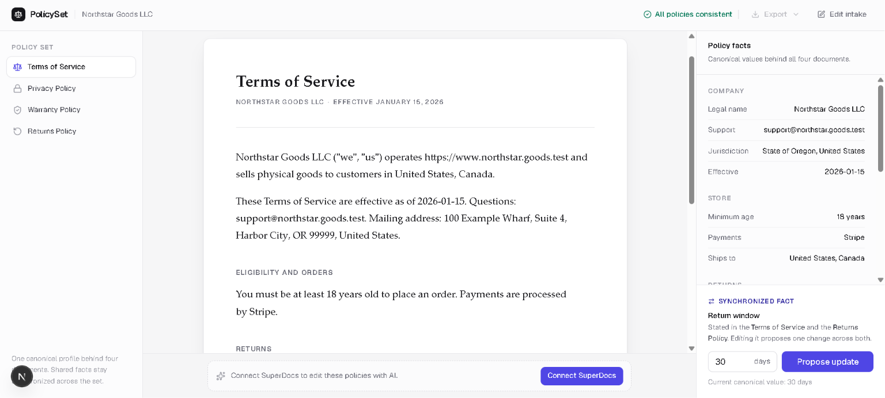

# PolicySet

A policy workspace that turns one structured intake into a consistent four-document legal policy set, then uses SuperDocs for AI-assisted editing, human review, and DOCX/PDF export.

> Drafted for attorney review, not legal advice.

PolicySet is an S2 SuperDocs build for an early-stage fictional physical-goods business, Northstar Goods. It produces matched Terms of Service, Privacy Policy, Warranty Policy, and Returns Policy without asking an AI model to invent or reconcile the underlying business facts. 



## What it does

One guided four-step intake creates a canonical `PolicyProfile`. PolicySet deterministically renders that profile into four policies, validates their shared facts, and uploads the DOCX set to one SuperDocs session. From the workspace, a reviewer can request an AI edit for the selected document, inspect the proposed changes, approve or reject them, and export the result as DOCX or PDF.

## Why PolicySet

A typical generator can draft four documents independently and accidentally create four versions of reality. PolicySet instead gives company identity, contact details, effective dates, return terms, warranty terms, and privacy practices one canonical source.

The product boundary is deliberate:

- **PolicySet owns facts:** the canonical profile, dependency mapping, rendering, and validation.
- **AI owns language:** edits improve a selected document's wording without silently rewriting canonical facts.
- **SuperDocs owns document editing, review, and export:** real proposals and downloadable document artifacts flow through its API.
- **Humans own approval:** proposed changes do not land until a reviewer explicitly approves them.

## Core flow

```text
Guided intake
      ↓
Canonical PolicyProfile
      ↓
Terms · Privacy · Warranty · Returns
      ↓
SuperDocs session
      ↓
Document-specific AI proposal
      ↓
Human approve / reject
      ↓
DOCX / PDF
```

Initial policies are generated deterministically by PolicySet. SuperDocs is used after generation for document editing, review, and export; it is not presented as the source of the initial legal drafts.

## Consistency and safety

- A canonical `PolicyProfile` supplies shared facts to all four renderers.
- An explicit dependency registry maps each managed fact to every document that depends on it.
- Deterministic rendering and set-level validation check required documents, shared values, and the attorney-review notice.
- Selected-document AI edits are pinned to that document and require explicit approval or rejection.
- The advanced synchronized ChangeSet path checks affected-document scope and every known managed occurrence before approval.
- Incomplete, polluted, or structurally unsafe synchronized proposal batches fail closed and are denied.
- AI completion text is never accepted as proof that a managed update is complete.
- Canonical facts commit only after the authoritative documents are re-read and pass post-edit validation.

## SuperDocs integration

The verified core lifecycle is:

```text
upload four DOCX files
→ send an edit instruction for the selected document
→ poll for proposed changes
→ explicitly approve or reject each review batch
→ refresh authoritative document content
→ verify document focus and export as DOCX or PDF
```

One SuperDocs session hosts all four policies in the core workflow. The API key stays server-side; Next.js route handlers initialize the session, start and poll edit jobs, submit review decisions, refresh the document roster, and export the selected document. Export refuses to proceed if the selected document or current four-document map does not match the authoritative session roster.

## Verified core behavior

- [x] Four policies generated from one guided intake
- [x] Matching company, contact, effective-date, return, and warranty facts
- [x] Required “drafted for attorney review, not legal advice” notice in generated and exported documents
- [x] All four policies uploaded to one SuperDocs session
- [x] Real selected-document SuperDocs AI edit with human review and approval/rejection
- [x] Approved document refreshed from authoritative SuperDocs content
- [x] Clean DOCX and PDF export
- [x] Automated tests run without a live API key

The manually validated path was: intake → four policies → connect SuperDocs → single-document edit → review → approve → export.

## Quick start

```bash
git clone https://github.com/OmkarBansod02/superdocs-builds.git
cd superdocs-builds/use-cases/OmkarBansod02/policyset
npm install
cp .env.example .env.local
```

Add a SuperDocs API key to `.env.local`:

```dotenv
SUPERDOCS_API_KEY=your_key_here
```

Then start the app:

```bash
npm run dev
```

Open [http://localhost:3000](http://localhost:3000). The fictional Northstar Goods intake is prefilled; complete the four steps and select **Generate policy set**. A key is required for SuperDocs connection, editing, review, and export, but not for deterministic generation or automated tests.

## Testing

```bash
npm test
npm run typecheck
npm run lint
npm run build
```

These checks do not require `SUPERDOCS_API_KEY` or make live SuperDocs calls. Tests focus on the claims that matter here: cross-document consistency, DOCX structure and legal notice, server-only credentials, document targeting, explicit review, export identity checks, and fail-closed synchronized-edit gates.

## Project structure

| Path | Purpose |
| --- | --- |
| `src/domain/` | Canonical profile, dependency registry, ChangeSets, renderers, occurrence model, and validators |
| `src/documents/` | Deterministic DOCX generation from rendered policy content |
| `src/superdocs/` | Server-side API adapter, PolicySet orchestration, proposal gates, and export boundary |
| `src/app/policyset/` | Guided intake and four-document review workspace |
| `src/app/api/policyset/` | Server-only route handlers for SuperDocs operations |
| `tests/` | Domain, document, workspace, SuperDocs, review, export, and safety-gate tests |

## Advanced synchronization and known rough edges

PolicySet includes an experimental synchronized ChangeSet path for managed facts such as a return-window change from 30 to 14 days. It resolves affected documents through the dependency registry, checks deterministic managed-occurrence coverage, rejects unsafe batches, and updates the canonical profile only after authoritative post-edit validation.

This path is safety work, not a fully verified production capability. Live validation found incomplete occurrence coverage even in explicitly pinned edits, completion-style AI text that overstated proposal completeness, nondeterministic routing and proposal behavior in multi-document experiments, and unresolved same-session job-state behavior. The synchronized 30-to-14 flow has **not** completed a live approved commit.

PolicySet mitigates these cases by denying incomplete or unsafe proposals and leaving the canonical profile unchanged. The findings have different evidence levels and are not all claimed as confirmed provider bugs. See [SUPERDOCS_ISSUES.md](./SUPERDOCS_ISSUES.md) for sanitized proposal observations, classifications, and reproduction details; same-session job-state behavior remains under investigation.

Other current scope limits: intake and workspace state are not persisted across refresh, synchronized editing is currently scoped to `returns.windowDays`, and the validators check PolicySet-managed consistency rather than legal compliance.

## Legal and scope

PolicySet uses fictional, synthetic company data. Its documents are drafts for attorney review, not legal advice, and the project is not positioned as automated legal counsel or a guarantee of regulatory compliance.

## SuperDocs task

Built for the SuperDocs Engineer Task.
